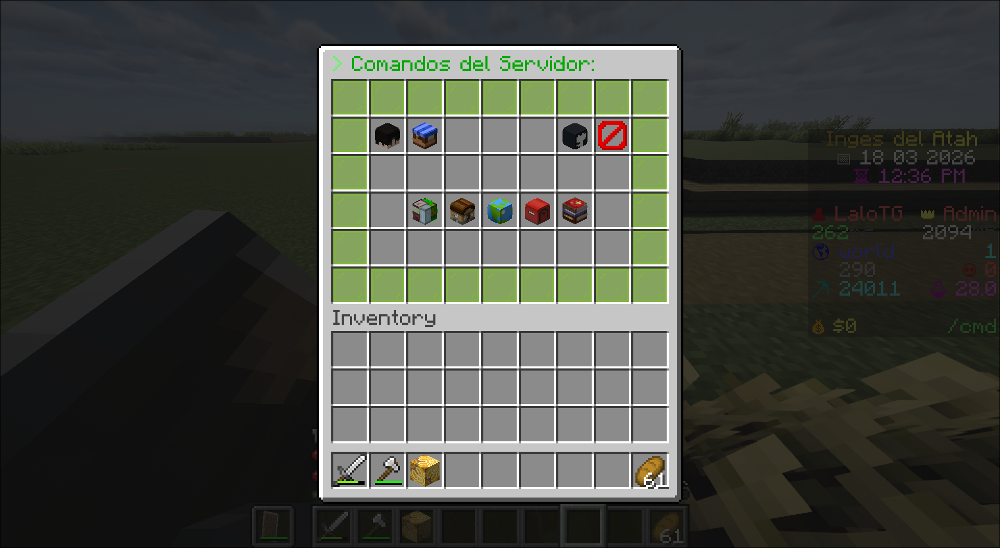
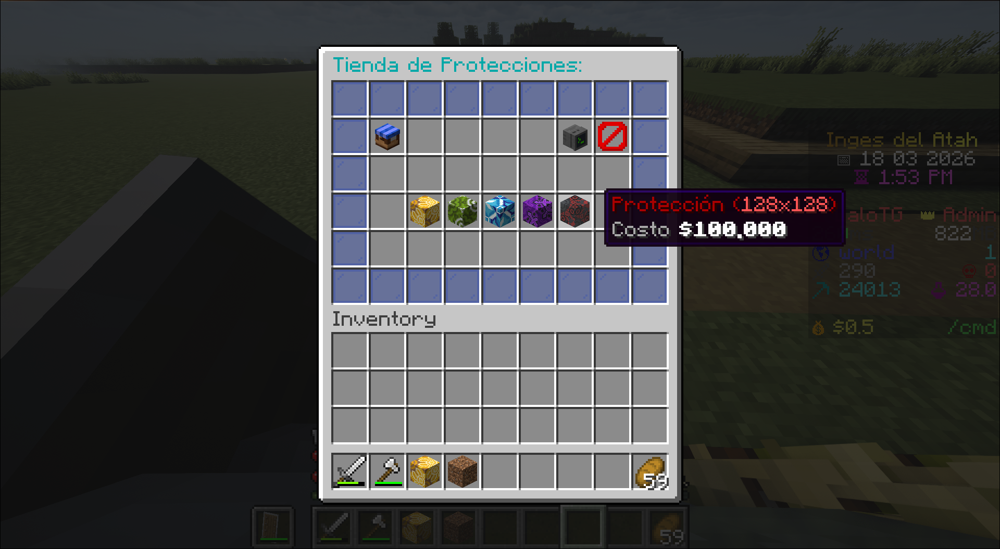
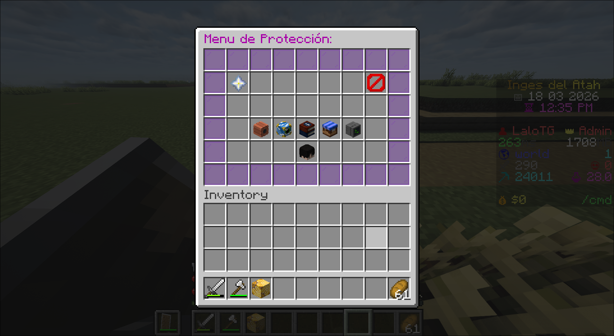
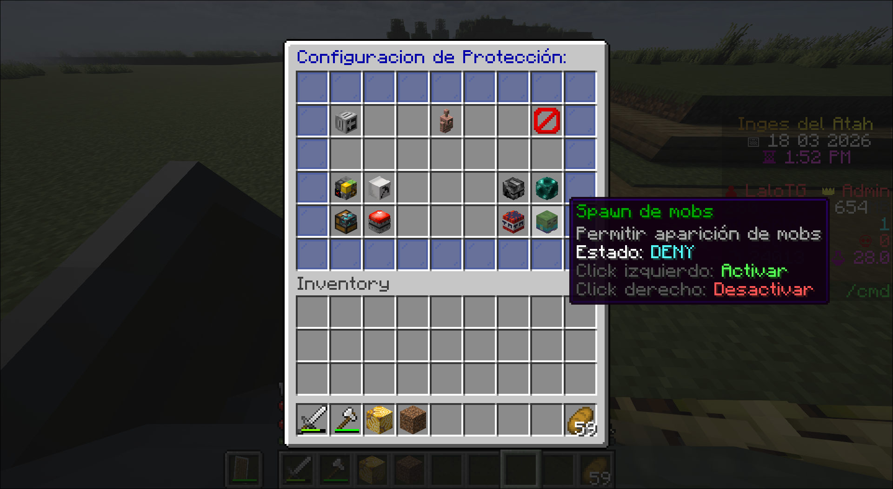

# Configuración de un servidor de Minecraft
Este repositorio nace como un proyecto personal (hobby) para documentar y compartir la configuración de mi propio servidor de Minecraft.
La idea es que pueda servir como referencia para cualquiera que quiera montar su propio servidor desde cero, especialmente usando Arch Linux.

## Requisitos
Antes de comenzar, necesitas tener instalado:
* Docker
* Docker Compose

## Plugins
Estos son los plugins que actualmente utilizo en el servidor:

| Core / Servidor   | Gameplay/Economía  | Visual / UI       | Administración   | Mundo            |
|-------------------|--------------------|-------------------|------------------|------------------|
| bStats            | AuraSkills         | DecentHolograms   | LuckPerms        | Chunky           |
| Floodgate         | TheNewEconomy      | DeluxeMenus       | InvSee++         | WorldEdit        |
| Geyser            | UJobs              | TAB               | MyCommand        | WorldGuard       |
| Spark             | HuskHomes          | PlaceholderAPI    | Skript           | ProtectionStones |
| Vault             |                    | LPC               | SkBee            |                  |
| Updater           |                    |                   |                  |                  |

## Sobre este repositorio
**Importante:**
En este repositorio solo incluyo mis configuraciones personalizadas.
Muchos plugins generan automáticamente sus propios archivos de configuración por defecto al iniciarse, pero esos no están incluidos aquí.
**Solo encontrarás:**
* Archivos que he creado
* Archivos que he modificado manualmente
## Notas:
Este proyecto no busca ser una guía definitiva, sino más bien un punto de partida o referencia práctica. Cada servidor puede requerir ajustes dependiendo de lo que quieras lograr.

## Screenshots De las Interfaces
* **Menú de Comandos**

* **Tienda de Protecciones**

* **Menú de la protección**

* **Configuracion de la protección**

* **Muestra del ScoreBoard [TAB]**

